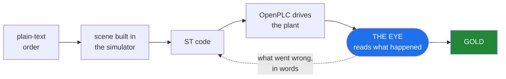
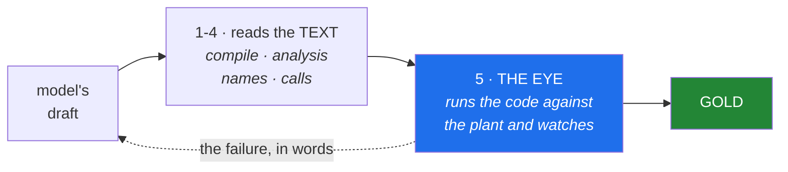
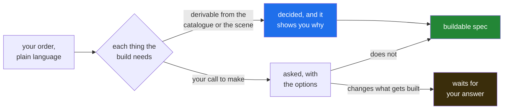

# VC Assist

VC Assist generates IEC 61131-3 Structured Text for industrial cells, runs that
code on a real soft-PLC against a simulated plant, and reads what actually
happened in the simulation to decide whether the code is correct.

A failure comes back as a sentence you can act on: which signal rose too early,
by how many seconds, and what that made the line do. That sentence is what the
code is rewritten from.

## What it runs on

| | Version | Status |
|---|---|---|
| Visual Components | **4.10 Premium** | everything is measured on this |
| Visual Components | 5.0 | prepared for in the installer, **unverified** |
| Visual Components | 3.x and older | will not work — no modern API or add-on architecture |
| OpenPLC Runtime | **v4**, pinned by sha256 digest | the address is configuration, never an assumption |
| Python (host) | 3.10 – 3.13 | measured |
| Python (host) | 3.9 | installer works; the verification step needs 3.10 |
| Python (inside the simulator) | 2.7 and 3.x | every file is checked against both at install time |
| Linux | Wine ≥ 11.15 | below that the licence engine dies on `bcrypt HashBlockLength` — measured |
| Windows | nothing beyond VC itself | supported — development has been on Linux, so `python3 tests/protocol/kor_E1_windows_16punkter.py` verifies your setup |

No `pip install`, no `requirements.txt`. The installer and the add-on use the
standard library only, on both platforms.

## How it works



Each step, concretely:

**The order** is free text. *"A conveyor feeds cartons to a robot that
palletises eight boxes per layer on a EUR pallet. Place height is measured from
the top of the layer. Buffer ahead of the station, target 100 units per hour."*

**The build plan** turns that into a runnable sequence. It reads more than the
component list: throughput, cell footprint, walkway clearance, reach, the
relations between machines, and the order the processes must run in. From a
measured run:

> *"Build a picking station that handles 400 parts per hour, with an infeed
> conveyor, a robot and an outfeed box. The cell is 8 by 8 metres with an
> 800 mm walkway. The conveyor feeds the robot, the robot feeds the reject
> box. Write the PLC code."*

An order that contradicts itself is **rejected** rather than built halfway. Ask
for a robot that reaches both the conveyor and the pallet, in a cell no larger
than 2 by 2 metres, and whether that is possible depends on the reach of the
robot you picked — so it is looked up, not guessed. You get back the
two requirements that cannot both hold, and which one to change.

**The scene** is assembled from component types the system builds itself —
conveyor, feeder, buffer, sink — plus machines drawn from the simulator's
library.

**The ST code** is written by a language model that cannot see the answer key.
The transport enforces this in two layers: an empty tool list, and a working
directory outside the repository.

**OpenPLC** compiles and runs the code as a real soft-PLC. It drives the
simulation over OPC UA, the same protocol a physical PLC would use.

Generated logic is interlocked *by* the safety PLC and never part of it — the
architecture every real cell already uses, and the one IEC 61508 and ISO 13849
require. The bench contains tasks in exactly that shape: a press with two-hand
control where the generated sequence runs only while the certified circuit
permits it.

**The eye** samples the entire scene while it runs — every object's position,
every signal, every edge — and judges on five axes: sequence, timing, grasp,
collision and throughput.

**The loop back** is what the model receives. Not "it failed" — which signal
rose too early, by how many seconds, and which station therefore began working
on a part the previous station had not finished.

## Finding the right machine

Search the installed library by what you need — reach, payload, manufacturer —
rather than by guessing a part number.

Every reach figure carries where it came from, because none of them is read
from a field — the library declares no reach at all. The number is computed from
the robot's own kinematics, two ways: from its named link lengths where it has
them, and from the transforms of its kinematic chain where it does not.
**1 993 of 2 202 robots** get a figure that way. The remaining 209 say *missing*,
never zero.

Which of the two paths produced a figure is written into the answer, and the
order between them is measured rather than assumed: where they disagree by more
than 5 %, the link-length formula is closer to the manufacturer's own published
reach in 86 cases and the transform path in 47, so the first runs first.

## The gate chain

Four checks read the code as **text**: does it compile, is anything unreachable,
do the names and types exist, are the function blocks real. They are fast, they
need no simulator, and they can all pass on code that is wrong.



The first four are fast and need no simulator. But a station can pass every one
of them — syntax clean, names real, sequence in order — and still release its
grip while the part is nowhere near where it should be. Only running it against
a plant shows that.

It watches the whole line, not one station, because faults live in the gaps
between stations. Five in our measurement passed each station individually and
appeared only when the stations were connected: a downstream station started on
*"a part is present"* instead of on *"the previous station is finished"*.

## What has been measured

| | |
|---|---|
| **linear** | cost of reading the scene grows proportionally with component count, measured from 200 to 800 — 4.3 µs per component per sample on an i5-13600K running VC under Wine |
| **20 /s** | scene samples taken while the simulation runs, its default rate |
| **0** | positional drift over a full run |
| **4 of 5** | classes of line fault caught that each station passed on its own — the fifth does not reproduce reliably when the run is repeated, so it is not counted |
| **25 of 26** | tasks solved within four rounds of writing and correcting, median two |
| **4 of 26** | solved on the first attempt — which is why the correction loop exists |
| **834 of 899** | deliberate faults injected into working code, and caught |
| **63** | cells in the task set — 49 with a full answer key — across transport, picking, assembly, sorting, palletising, whole lines and robot handover |

Every number has a measurement file behind it, stating the rig it ran on and
what it does not show. Figures above are as of **2026-09-06**; they change as the
project measures more.

## Where this is going

**Natural language across the whole job.** The input is plain language, from a
precise specification to a rough intention to a change to a cell that already
exists.

How much work happens before anything is built follows from the order itself.
*Swap that gripper* settles in one step. *Build a picking station that handles
400 parts per hour* has throughput, footprint, walkway clearance, reach and
process order to resolve first — and each of those is either derived, and
recorded with the reasoning that produced it, or put back to you as a question.
Nothing is filled in silently, and the questions that block the build are marked
apart from the ones that do not.



There is no difficulty setting and no complexity tier. The amount of work is
whatever the order leaves unresolved.

*Why does station 3 starve* works today, answered from measurements and quoting
them. *Swap that gripper* has its gates: if the sentence fits three grippers you
get all three back and nothing is written until you pick one. *Speed this line
up* is not built, and says so rather than guessing.

**Brownfield reconstruction.** Most lines on a factory floor are older than
their documentation, and the original PLC project is usually gone. Given a
recording of the plant's inputs and outputs, the control logic can be derived
back out of it — every interlock recovered, in the runs measured so far.

What the recording contains decides what can be recovered. One made during
commissioning, where the fault paths are exercised, gives everything. One taken
off a line running a normal shift gives the sequence and little else, because
nothing in it ever went wrong.

**Line-level generation.** Faults between stations are a different problem from
faults inside one — several classes of them exist that every station passes on its
own. Generating and correcting the control code for a *complete line*, on the
eye's own reports, is the next milestone. The rig is built and waiting on a run.


**Vendor toolchains.** Export to PLCopen XML works and survives a round trip,
validated against the official schema and accepted by an independent toolchain.
Opening it in CODESYS or TwinCAT is untested — one exported file from anyone who
owns either would settle it for both.

## Getting started

```bash
git clone <repo>
cd vc-assist
python3 install/installera.py sok        # show what is present, write nothing
python3 install/installera.py installera # put the add-on in place
```

Python 3 and the standard library only. Tested on 3.10, 3.12 and 3.13, on Linux
under Wine and on Windows. Code that runs inside the simulator is valid in both
Python 2.7 and 3.x, because the embedded interpreter is 2.7.

Uninstalling removes exactly what was installed — the tree is byte-identical to
before.
