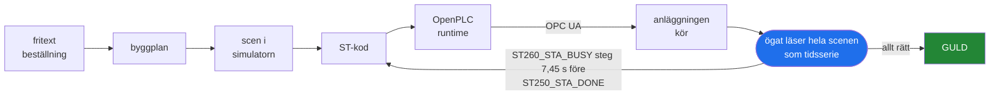
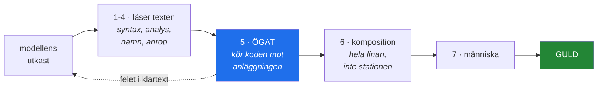
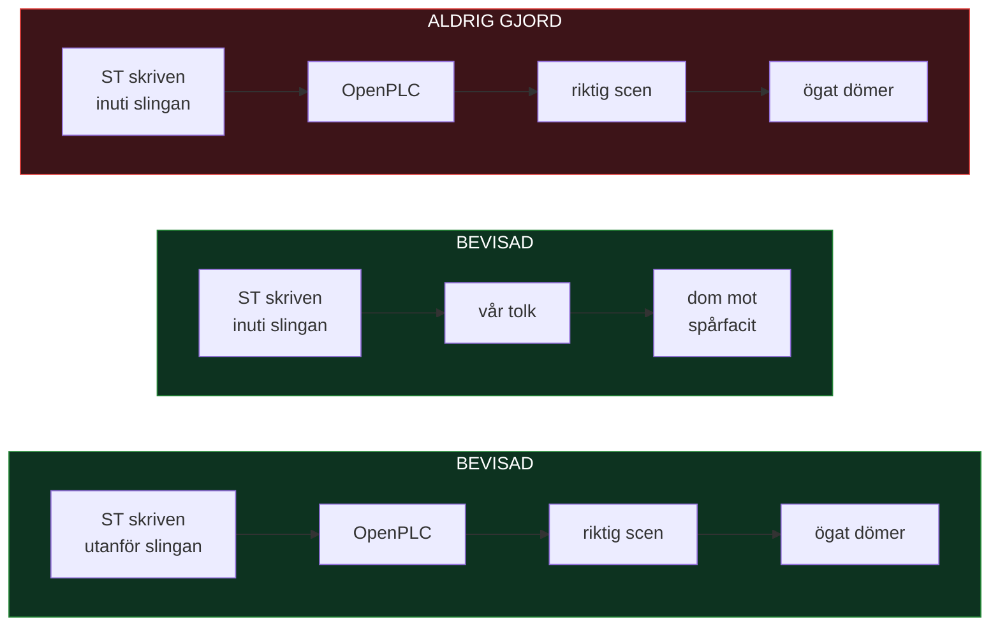

# VC Assist

**Skriver PLC-koden. Kör den på riktigt. Ser efter vad som faktiskt hände.**

De flesta verktyg som genererar styrkod svarar på frågan *kompilerar den?*
Det är fel fråga. En station kan kompilera perfekt och ändå släppa greppet
innan bandet stannat, starta nästa index 180 ms för tidigt, eller stå tyst för
evigt när en givare tystnar.

Det här verktyget svarar på frågan *vad hände i anläggningen?* — och matar
tillbaka svaret tills koden är rätt.



Den röda pilen tillbaka till ST-koden är hela poängen. Modellen får inte
"det gick fel" — den får **vilken signal som steg för tidigt, med hur många
sekunder, och vilken station som därför började arbeta i en enhet som inte var
klar.**

Det sista steget är det som inte finns någon annanstans. Vi har gått igenom
den publicerade litteraturen: LLM4PLC, Agents4PLC, AutoPLC, SemaPLC,
Spec2Control. **Ingen har publicerat kedjan där genererad kod deployas till en
soft-PLC, körs mot en anläggningsmodell, och resultatet matas tillbaka.**
Deras "closed loop" betyder formell verifiering, inte en körande fabrik.

---

## Vad du faktiskt gör med det

Du beskriver cellen i vanlig text:

> *"Ett band matar kartonger till en robot som palleterar åtta kolli per lager
> på EUR-pall. Avläggshöjden räknas från lagrets överkant. Buffert framför
> stationen, kapacitetsmål 100 enheter i timmen."*

Verktyget gör resten: planerar bygget och **avvisar beställningen om den
motsäger sig själv**, med vilket villkor som krockar. Bygger scenen av kända
komponenter. Skriver ST-koden. Kör den på OpenPLC. Låter den driva
simuleringen. Och läser sedan hela scenen som en tidsserie — varje objekts
läge, varje signal, varje flank — och dömer på fem axlar: sekvens, timing,
grepp, kollision och genomflöde.

Faller något får modellen ögats egna ord tillbaka och skriver om.

---

## Grindkedjan

Sju filter står mellan modellens första utkast och något du vågar köra. Det
avgörande är att de fyra första bara läser **texten** — och att en station kan
passera alla fyra och ändå släppa greppet på en meters höjd.



Grind 5 är den enda som kör koden. Den fångar en klass fel de fyra första
strukturellt inte kan se: *greppet bildades medan verktyget stod 642 mm från
kortet.* Texten var felfri.

Grind 6 finns för att fem fel i vår mätning passerade **båda** stationerna var
för sig, och syntes först när de kopplades ihop.

## Vad som är mätt

Varje siffra nedan står i en mätningsfil i repot, med sin rigg och sina
gränser. Inget här är uppskattat.

**Ögat**
* 812 objekt i tidsserie, **noll drift**, 4,3 µs per komponent och prov
* provtagning **224,7 Hz** under trafik, 17,2 Hz i vila
* **4 av 5 domare** fäller celler byggda i riktig simulator, med en grön
  kontrollcell som inte får fällas

**Slingan**
* handskriven ST styr scenen genom OPC UA, tur och retur i **9,91 ms** median
* två stationer på en lina: **fem kompositionsfel fällda** som båda
  enstationskörningarna släppte igenom
* fyra komponenttyper byggda ur specen i riktig simulator, **13 produkter
  genom kedjan med exakt 3,0000 s** mellan varje

**Bänken**
* **63 uppgifter** i sju familjer: transport, plock, montering, sortering,
  palletering, cell och linje, överlämning
* flerskott: **25 av 26 lösta** inom fyra varv, median två varv
* enskott: **4 av 26** — och det talet är varför reparationsslingan finns
* mutationsprov: **809 kända skador**, 718 fångade

**Grindkedjan**
* sju grindar: kompilering, statisk analys, deklarationsmatchning,
  anropsvalidering, ögat, komposition, människa
* 247 permanenta språkfall korsprövade mot en andra kompilator
* och sedan idag en **tredje** motor: koden döms av OpenPLC:s egen runtime,
  inte bara av vår tolk

---

## Var vi står, ritat ärligt



Två halvor byggdes var för sig, med avsikt: de tidiga faserna skulle bevisa
att **vägen** finns, en senare fas att **modellen** hittar den. Mätningarna
säger det själva — *"Fas 8 påstår att kompositionen går att döma, inte att en
språkmodell hittar den."*

De har ännu inte satts ihop, och det steget är nästa. Faller det, är produkten
bänken och inte slingan — och det svaret är värt mer än att inte veta.

## Vad det inte gör, sagt rakt ut

Den här listan är kort med flit. Ett verktyg som inte säger var det slutar är
ett verktyg man inte kan lita på.

* **Ingenting genererat rör en säkerhetsfunktion.** Nödstopp och skyddskretsar
  ligger på certifierad säkerhets-PLC i begränsat variabelt språk, skrivet av
  människa. Genererad logik ligger *bredvid* den, förreglad av den. Det är
  inte försiktighet — IEC 61508 och ISO 13849 kräver det.
* **Ögat är felfinnande, aldrig bevis.** Det säger att något gick fel. Det kan
  inte säga att allt är rätt.
* **Simuleringen saknar verkligheten.** Sensorstuds, ställdonsdynamik,
  fältbussjitter och degraderade lägen finns inte. "Simuleringen kraschade
  inte" är inget godkännandekriterium, här eller någon annanstans.
* **Ingen riktig anläggning är ännu inspelad**, och ingen hårdvaru-PLC har
  körts. Soft-PLC:n är den motor produkten riktar sig mot, men den är inte en
  fabrik.

---

## Varför det är byggt som det är

Tre regler har format varje rad i repot:

**Ingen tröskel utan mätreferens.** Står det `if x > 0.8` finns en mätning som
säger varifrån 0,8 kommer. Annars är talet en gissning som ser ut som kunskap.

**Ingen grind utan trasig fixtur.** En grind som aldrig fällt något är inte
prövad. Fixturen skrivs först, ses vara röd, och sedan byggs mekanismen.

**Ett facit får aldrig komma ur koden som döms.** Fem lagliga facitkällor står
i kontraktet, och ett facit härlett ur samma tolk som dömer det avvisas.

Det syns i talen. Nio av sexton grinddomar i en tidig körning var vår egen
bugg — vi mätte det, skrev ned det, och lagade grinden. Tre av tretton
dubbelskrivningsdomar var falska röda som brände reparationsvarv; de kostade
oss en dag att hitta och står nu som permanenta provfall.

---

## Kom igång

```bash
git clone <repo>
cd vc-assist
python3 install/installera.py sok        # visa vad som finns, skriv ingenting
python3 install/installera.py installera # lägg tillägget på plats
```

Enbart Python 3 och standardbiblioteket. Kört på 3.10, 3.12 och 3.13, på
Linux under Wine och på Windows. Koden som körs inne i simulatorn är giltig i
både Python 2.7 och 3.x, eftersom den inbäddade tolken är 2.7.

Avinstallationen tar bort exakt det installationen la dit — trädet blir
byte-identiskt med före.
