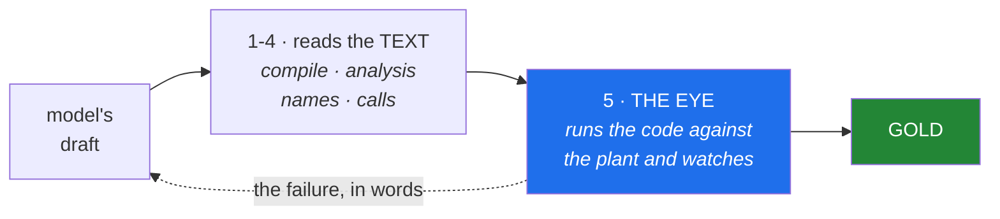
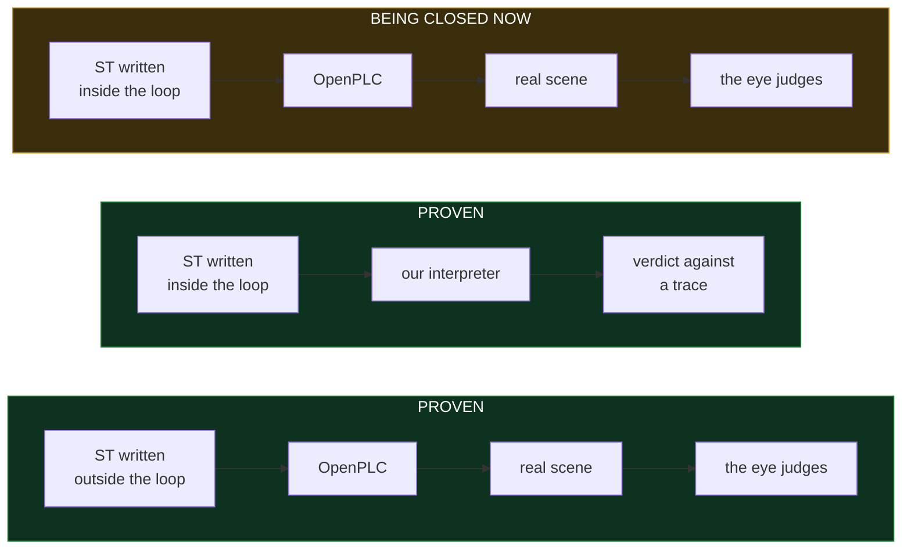

# VC Assist

If you do virtual commissioning, you know the shape of the day: inventory the
signals, wire the maps, set the directions, connect the scene to the PLC, run
the simulation, and then hunt the timing fault that only appears on the ninth
cycle.

VC Assist writes the Structured Text, runs it on a real soft-PLC against the
scene, and reads what the plant actually did — every object's position, every
signal, every edge — to find the sequence and timing faults for you. When it
finds one, it says which signal rose too early and by how much, and hands that
back to the model to fix.

It does not answer *does it compile?* It answers *what happened in the plant?*

## What it runs on

| | Version | Status |
|---|---|---|
| Visual Components | **4.10 Premium** | everything is measured on this |
| Visual Components | 5.0 | prepared for in the installer, **unverified** |
| Visual Components | 3.x and older | will not work — no modern API or add-on architecture |
| OpenPLC Runtime | **v4**, pinned by sha256 digest | the address is configuration, never an assumption |
| Python (host) | 3.10 – 3.13 | measured |
| Python (host) | 3.9 | installer works; the verification step needs 3.10 |
| Python (inside the simulator) | 2.7 and 3.x | every file is checked against both at install time |
| Linux | Wine ≥ 11.15 | below that the licence engine dies on `bcrypt HashBlockLength` — measured |
| Windows | nothing beyond VC itself | supported; `python3 tests/protocol/kor_E1_windows_16punkter.py` confirms it on your machine |

No `pip install`, no `requirements.txt`. The installer and the add-on use the
standard library only, on both platforms.

## How it works


Each step, concretely:

**The order** is free text. *"A conveyor feeds cartons to a robot that
palletises eight boxes per layer on a EUR pallet. Place height is measured from
the top of the layer. Buffer ahead of the station, target 100 units per hour."*

**The build plan** turns that into a runnable sequence. It reads more than the
component list: throughput, cell footprint, walkway clearance, reach, the
relations between machines, and the order the processes must run in. From a
measured run:

> *"Build a picking station that handles 400 parts per hour, with an infeed
> conveyor, a robot and an outfeed box. The cell is 8 by 8 metres with an
> 800 mm walkway. The conveyor feeds the robot, the robot feeds the reject
> box. Write the PLC code."*

An order that contradicts itself is **rejected** rather than built halfway. Ask
for a robot that reaches both the conveyor and the pallet, in a cell no larger
than 2 by 2 metres, and whether that is possible depends on the reach of the
robot you picked — so it is looked up, not guessed. You get back the two
conditions that collide, in your own words.

**The scene** is assembled from component types the system builds itself —
conveyor, feeder, buffer, sink — plus machines drawn from the simulator's
library.

**The ST code** is written by a language model that cannot see the answer key.
The transport enforces this in two layers: an empty tool list, and a working
directory outside the repository.

**OpenPLC** compiles and runs the code as a real soft-PLC. It drives the
simulation over OPC UA, the same protocol a physical PLC would use.

Generated logic is interlocked *by* the safety PLC and never part of it — the
architecture every real cell already uses, and the one IEC 61508 and ISO 13849
require. The bench contains tasks in exactly that shape: a press with two-hand
control where the generated sequence runs only while the certified circuit
permits it.

**The eye** samples the entire scene while it runs — every object's position,
every signal, every edge — and judges on five axes: sequence, timing, grasp,
collision and throughput.

**The loop back** is what the model receives. Not "it failed" — which signal
rose too early, by how many seconds, and which station therefore began working
on a part the previous station had not finished.

We read five papers in full before building it — LLM4PLC, Agents4PLC, AutoPLC,
SemaPLC and Spec2Control. Each closes its loop around formal verification or a
test harness; none of them reports running the generated code on a PLC against a
plant model and correcting it from the result. Nor does any vendor publish a
correctness figure at all. What happens in labs we cannot see is another
question.

## Finding the right machine

The library holds **3 201 machines**, around 2 200 of them robots. Search it by what
you need — reach, payload, manufacturer — not by guessing a part number.

Ask something broad like *"robots"* and you get a breakdown by manufacturer and
a prompt to narrow down, not two thousand rows. Every result says how many hits there
were and how many you are seeing.

If the library does not know a machine's reach, it says so. It never shows a
blank as zero — a distinction that matters, because the library reports zero
reach for 1 119 machines whose datasheets say otherwise.

## The gate chain

Four checks read the code as **text**: does it compile, is anything unreachable,
do the names and types exist, are the function blocks real. They are fast, they
need no simulator, and they can all pass on code that is wrong.



The eye caught this, and the four text checks could not: *the grasp formed while
the tool was 642 mm from the board.* The syntax was flawless, every name
existed, the sequence was in order — and the robot closed its gripper more than
half a metre from the part.

It watches the whole line, not one station, because faults live in the gaps
between stations. Five in our measurement passed each station individually and
appeared only when the stations were connected: a downstream station started on
*"a part is present"* instead of on *"the previous station is finished"*.

## Where the project stands



The two halves were built separately and on purpose: the early phases proved the
*path* exists, a later phase that a *model* can find it. The distinction is not
human versus machine — the reference bodies were written by a model too. It is
**outside the loop** (full context, tools, the scene in view, unlimited
attempts) versus **inside it** (one prompt, no tools, a cap of four rounds, a
gate deciding). Joining them is the current work: generated
code is now judged by OpenPLC's own runtime rather than only by our interpreter,
and the rig that lets a model author a whole line and receive the eye's reply is
being built.

## What has been measured

Every number here has a measurement file behind it, with the rig it ran on and
what it does not show.

**It reads the whole scene, cheaply.** A 812-object cell is captured in
**3.5 milliseconds** — 4.3 microseconds per object — so it can sample 225 times
a second while the simulation runs, without slowing it down. Positions come back
with no drift.

**It finds faults a single station cannot show you.** On a two-station line it
caught five that each station passed on its own — the kind that only exist in
the gap between machines.

**It usually gets there in two tries.** Across 26 tasks with a known answer, 25
were solved within four rounds of writing and correcting, median two. On the
first attempt alone, 4 of 26 — which is why the correction loop exists.

**The judging has been tested against itself.** 809 deliberate faults were
injected into working code to see how many the system would catch: 718.

The task set is 63 cells across transport, picking, assembly, sorting,
palletising, whole lines, and robot handover.

## How we keep ourselves honest

Every threshold in the code points at the measurement it came from. Every check
has a test that failed before the check existed. An answer key never comes from
the code being tested.

This is not decoration. Nine of sixteen verdicts in an early run turned out to
be our own bug, and three more were false alarms that made the model rewrite
working code. Both were found by these rules and are now permanent test cases.

## Getting started

```bash
git clone <repo>
cd vc-assist
python3 install/installera.py sok        # show what is present, write nothing
python3 install/installera.py installera # put the add-on in place
```

Python 3 and the standard library only. Tested on 3.10, 3.12 and 3.13, on Linux
under Wine and on Windows. Code that runs inside the simulator is valid in both
Python 2.7 and 3.x, because the embedded interpreter is 2.7.

Uninstalling removes exactly what was installed — the tree is byte-identical to
before.
