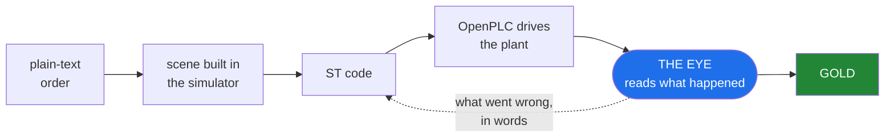
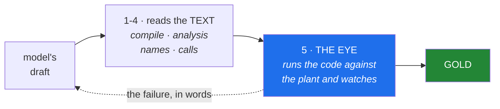
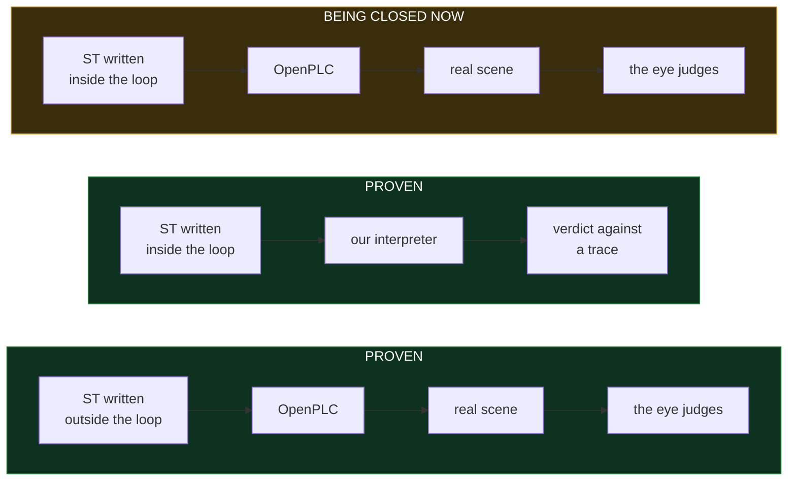

# VC Assist

VC Assist generates IEC 61131-3 Structured Text for industrial cells, runs that
code on a real soft-PLC against a simulated plant, and reads what actually
happened in the simulation to decide whether the code is correct.

When something goes wrong it does not report a failure. It reports which signal
rose too early, by how much, and which station therefore began working on a part
that was not ready — and hands that back to be corrected.

## What it runs on

| | Version | Status |
|---|---|---|
| Visual Components | **4.10 Premium** | everything is measured on this |
| Visual Components | 5.0 | prepared for in the installer, **unverified** |
| Visual Components | 3.x and older | will not work — no modern API or add-on architecture |
| OpenPLC Runtime | **v4**, pinned by sha256 digest | the address is configuration, never an assumption |
| Python (host) | 3.10 – 3.13 | measured |
| Python (host) | 3.9 | installer works; the verification step needs 3.10 |
| Python (inside the simulator) | 2.7 and 3.x | every file is checked against both at install time |
| Linux | Wine ≥ 11.15 | below that the licence engine dies on `bcrypt HashBlockLength` — measured |
| Windows | nothing beyond VC itself | supported — development has been on Linux, so `python3 tests/protocol/kor_E1_windows_16punkter.py` verifies your setup |

No `pip install`, no `requirements.txt`. The installer and the add-on use the
standard library only, on both platforms.

## How it works



Each step, concretely:

**The order** is free text. *"A conveyor feeds cartons to a robot that
palletises eight boxes per layer on a EUR pallet. Place height is measured from
the top of the layer. Buffer ahead of the station, target 100 units per hour."*

**The build plan** turns that into a runnable sequence. It reads more than the
component list: throughput, cell footprint, walkway clearance, reach, the
relations between machines, and the order the processes must run in. From a
measured run:

> *"Build a picking station that handles 400 parts per hour, with an infeed
> conveyor, a robot and an outfeed box. The cell is 8 by 8 metres with an
> 800 mm walkway. The conveyor feeds the robot, the robot feeds the reject
> box. Write the PLC code."*

An order that contradicts itself is **rejected** rather than built halfway. Ask
for a robot that reaches both the conveyor and the pallet, in a cell no larger
than 2 by 2 metres, and whether that is possible depends on the reach of the
robot you picked — so it is looked up, not guessed. You get back the
two requirements that cannot both hold, and which one to change.

**The scene** is assembled from component types the system builds itself —
conveyor, feeder, buffer, sink — plus machines drawn from the simulator's
library.

**The ST code** is written by a language model that cannot see the answer key.
The transport enforces this in two layers: an empty tool list, and a working
directory outside the repository.

**OpenPLC** compiles and runs the code as a real soft-PLC. It drives the
simulation over OPC UA, the same protocol a physical PLC would use.

Generated logic is interlocked *by* the safety PLC and never part of it — the
architecture every real cell already uses, and the one IEC 61508 and ISO 13849
require. The bench contains tasks in exactly that shape: a press with two-hand
control where the generated sequence runs only while the certified circuit
permits it.

**The eye** samples the entire scene while it runs — every object's position,
every signal, every edge — and judges on five axes: sequence, timing, grasp,
collision and throughput.

**The loop back** is what the model receives. Not "it failed" — which signal
rose too early, by how many seconds, and which station therefore began working
on a part the previous station had not finished.

## Finding the right machine

Search the installed library by what you need — reach, payload, manufacturer —
rather than by guessing a part number.

If the library does not know a machine's reach, it says so. It never shows a
blank as zero — a distinction that matters, because a great many entries carry
no reach at all while their datasheets do.

## The gate chain

Four checks read the code as **text**: does it compile, is anything unreachable,
do the names and types exist, are the function blocks real. They are fast, they
need no simulator, and they can all pass on code that is wrong.



The first four are fast and need no simulator. But a station can pass every one
of them — syntax clean, names real, sequence in order — and still release its
grip while the part is nowhere near where it should be. Only running it against
a plant shows that.

It watches the whole line, not one station, because faults live in the gaps
between stations. Five in our measurement passed each station individually and
appeared only when the stations were connected: a downstream station started on
*"a part is present"* instead of on *"the previous station is finished"*.

## Where the project stands



The two halves were built separately and on purpose: the early phases proved the
*path* exists, a later phase that a *model* can find it. The distinction is not
human versus machine — the reference bodies were written by a model too. It is
**outside the loop** (full context, tools, the scene in view, unlimited
attempts) versus **inside it** (one prompt, no tools, a cap of four rounds, a
gate deciding). Joining them is the current work: generated
code is now judged by OpenPLC's own runtime rather than only by our interpreter,
and the rig that lets a model author a whole line and receive the eye's reply is
being built.

## What has been measured

| | |
|---|---|
| **linear** | cost of reading the scene grows proportionally with component count, measured from 200 to 800 — 4.3 µs per component per sample on an i5-13600K running VC under Wine |
| **225 /s** | samples taken while the simulation runs, without slowing it |
| **0** | positional drift over a full run |
| **5 of 5** | classes of line fault caught that each station passed on its own |
| **25 of 26** | tasks solved within four rounds of writing and correcting, median two |
| **4 of 26** | solved on the first attempt — which is why the correction loop exists |
| **718 of 809** | deliberate faults injected into working code, and caught |
| **63** | cells in the task set: transport, picking, assembly, sorting, palletising, whole lines, robot handover |

Every number has a measurement file behind it, stating the rig it ran on and
what it does not show. Figures above are as of **2026-09-06**; they change as the
project measures more.

## Where this is going

**Natural language across the whole job.** The input is plain language, and it
should cover the range a real engineer works in: a precise specification, a
rough intention, or a change to a cell that already exists — *speed this line
up*, *why does station 3 starve*, *swap that gripper*. The 122 tools underneath
already read and modify a running scene, and the planner already turns a build
order into a buildable spec or names the two conditions that collide. The route
from a loose sentence about an existing cell to the work being done is the piece
still to build.

**Line-level generation.** Faults between stations are a different problem from
faults inside one — five classes of them exist that every station passes on its
own. Generating and correcting the control code for a *complete line*, on the
eye's own reports, is the next milestone. The rig is built and waiting on a run.

**Brownfield reconstruction.** Most lines on a factory floor are older than
their documentation, and the original PLC project is usually gone. Given a
recording of the plant's I/O, the interlocks can be derived back out of it: **28
of 28** recovered from a recording made for the purpose.

From a recording of normal production the figure is **3 of 28**, and that
difference is the design problem worth solving. A line running a good shift
never trips its emergency stop, so a passive recording holds no example to learn
from. The route forward is provoked recordings — exercising the fault paths
deliberately during a commissioning window — and that is a scheduling question
more than a technical one.

**Vendor toolchains.** Export to PLCopen XML works and survives a round trip,
validated against the official schema and accepted by an independent toolchain.
Opening it in CODESYS or TwinCAT is untested — one exported file from anyone who
owns either would settle it for both.

## Getting started

```bash
git clone <repo>
cd vc-assist
python3 install/installera.py sok        # show what is present, write nothing
python3 install/installera.py installera # put the add-on in place
```

Python 3 and the standard library only. Tested on 3.10, 3.12 and 3.13, on Linux
under Wine and on Windows. Code that runs inside the simulator is valid in both
Python 2.7 and 3.x, because the embedded interpreter is 2.7.

Uninstalling removes exactly what was installed — the tree is byte-identical to
before.
