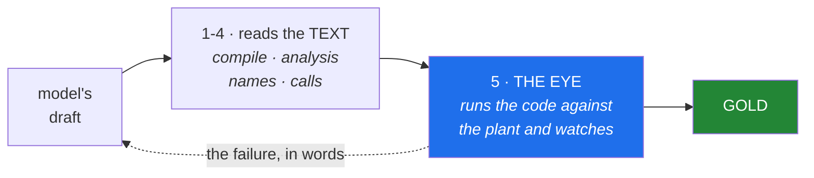
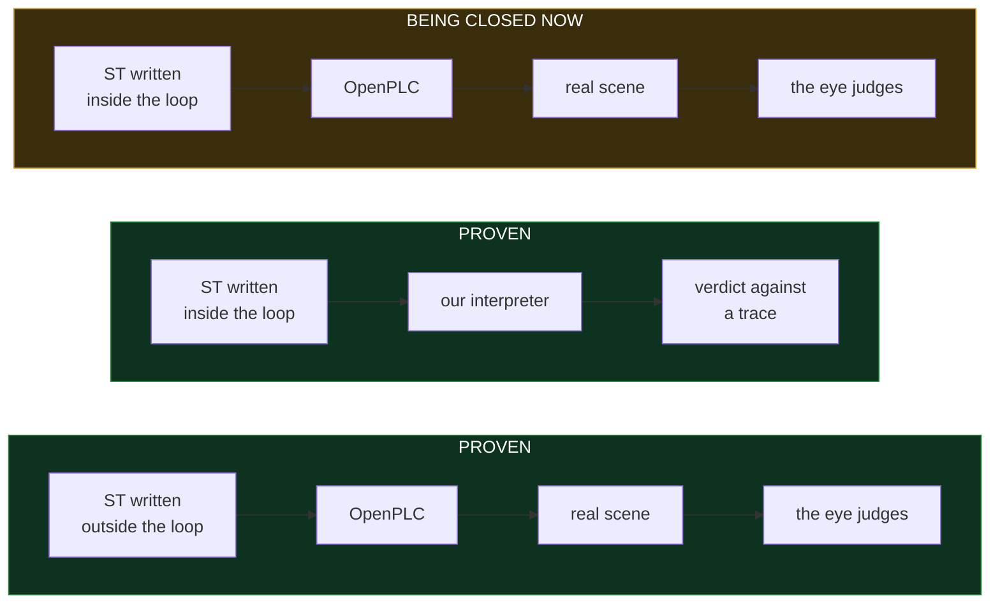

# VC Assist

VC Assist generates IEC 61131-3 Structured Text for industrial cells, runs that
code on a real soft-PLC against a simulated plant, and reads what actually
happened in the simulation to decide whether the code is correct.

The distinction that matters: most code-generation tools answer *does it
compile?* This one answers *what happened in the plant?* — and feeds the answer
back until the code is right.

## How it works


Each step, concretely:

**The order** is free text. *"A conveyor feeds cartons to a robot that
palletises eight boxes per layer on a EUR pallet. Place height is measured from
the top of the layer. Buffer ahead of the station, target 100 units per hour."*

**The build plan** turns that into a runnable sequence of components and
conditions — and rejects the order if it contradicts itself, naming which
condition collides, rather than building half of it.

**The scene** is assembled from component types the system knows: conveyor,
feeder, buffer, sink. Robots and grippers come from the simulator's library.

**The ST code** is written by a language model that cannot see the answer key.
The transport enforces this in two layers: an empty tool list, and a working
directory outside the repository.

**OpenPLC** compiles and runs the code as a real soft-PLC. It drives the
simulation over OPC UA, the same protocol a physical PLC would use.

Generated logic is interlocked *by* the safety PLC and never part of it — the
architecture every real cell already uses, and the one IEC 61508 and ISO 13849
require. The bench contains tasks in exactly that shape: a press with two-hand
control where the generated sequence runs only while the certified circuit
permits it.

**The eye** samples the entire scene while it runs — every object's position,
every signal, every edge — and judges on five axes: sequence, timing, grasp,
collision and throughput.

**The loop back** is the part that does not exist elsewhere. The model does not
receive "it failed". It receives which signal rose too early, by how many
seconds, and which station therefore began working on a part the previous
station had not finished.

## The gate chain

Four checks read the code as **text**: does it compile, is anything unreachable,
do the names and types exist, are the function blocks real. They are fast, they
need no simulator, and they can all pass on code that is wrong.



The eye caught this, and the four text checks could not: *the grasp formed while
the tool was 642 mm from the board.* The syntax was flawless, every name
existed, the sequence was in order — and the robot closed its gripper more than
half a metre from the part.

It watches the whole line, not one station, because faults live in the gaps
between stations. Five in our measurement passed each station individually and
appeared only when the stations were connected: a downstream station started on
*"a part is present"* instead of on *"the previous station is finished"*.

## Where the project stands



The two halves were built separately and on purpose: the early phases proved the
*path* exists, a later phase that a *model* can find it. The distinction is not
human versus machine — the reference bodies were written by a model too. It is
**outside the loop** (full context, tools, the scene in view, unlimited
attempts) versus **inside it** (one prompt, no tools, a cap of four rounds, a
gate deciding). Joining them is the
current work — as of today the generated code is judged by OpenPLC's own runtime
rather than only by our interpreter, and the rig that lets a model author a
whole line and receive the eye's reply is being built.

## What has been measured

Every number below has a measurement file in the repository, with its rig and
its stated limits. Nothing here is an estimate.

**The eye**
* 812 objects in a time series, **zero drift**, 4.3 µs per component per sample
* sampling at **224.7 Hz** under traffic, 17.2 Hz idle
* **4 of 5 judges** fail cells built in the real simulator, with a green control
  cell that must not fail

**The loop**
* reference ST drives the scene over OPC UA, round trip **9.91 ms** median
* two stations on one line: **five composition faults caught** that both
  single-station runs passed
* four component types built from the specification in the real simulator,
  **13 products through the chain at exactly 3.0000 s** apart

**The bench**
* **63 tasks** in seven families: transport, picking, assembly, sorting,
  palletising, cell and line, handover
* multi-shot: **25 of 26 solved** within four rounds, median two
* single-shot: **4 of 26** — which is why the repair loop exists
* mutation testing: **809 known faults injected**, 718 caught

**The gate chain**
* 247 permanent language cases cross-checked against a second compiler
* and, since today, a third engine: code is judged by OpenPLC's own runtime,
  not only by our interpreter

## Why it is built the way it is

Three rules shaped every line in the repository.

**No threshold without a measured reference.** If the code says `if x > 0.8`,
a measurement states where 0.8 came from. Otherwise the number is a guess
wearing the clothes of knowledge.

**No gate without a failing fixture.** A gate that has never caught anything is
untested. The fixture is written first, observed to be red, and only then is the
mechanism built.

**An answer key may never come from the code being judged.** Five legitimate
sources are listed in the bench contract, and an answer key derived from the
same interpreter that judges it is rejected.

The effect is visible in the numbers. Nine of sixteen gate verdicts in an early
run were our own bug — measured, written down, and fixed. Three of thirteen
double-write verdicts were false positives that burned repair rounds; they cost
a day to find and are now permanent test cases.

## Getting started

```bash
git clone <repo>
cd vc-assist
python3 install/installera.py sok        # show what is present, write nothing
python3 install/installera.py installera # put the add-on in place
```

Python 3 and the standard library only. Tested on 3.10, 3.12 and 3.13, on Linux
under Wine and on Windows. Code that runs inside the simulator is valid in both
Python 2.7 and 3.x, because the embedded interpreter is 2.7.

Uninstalling removes exactly what was installed — the tree is byte-identical to
before.
